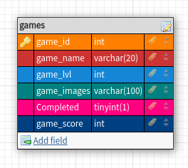

# Summary

This Cognitive Learning App aims to use simple drag-n-drop, as well as on-click triggered games, to help parents, educators, researchers, and developers understand how non-verbal individuals engage, learn and grow.

Although this is a Minimal Viable Product, and not a full functioning app, our aim is to find new ways in how we can assist their journey by improving their comprehensive,  thinking, and social skills that are free from any racial, ability, social-economical, regional, and identity status.

Activities are based on interviews with educators who specialize in teaching children with special needs, parents, and therapists, as well as the Snijders-Oomen Nonverbal Intelligence Test, also known as the SON-R 2 1/2-7 from the Netherlands, and from the US, commonly used methods such as P.E.R.M.A (Positive Emotion, Engagement, Relationships, Meaning, and Accomplishments), and research from the Child Mind Institute of NYC.

## Why should we care about this project?

The amount of free apps available that cater to special needs people are very limited, especially those targeted for children of low-income backgrounds. Many of these parents do not have access to educational services, or healthcare to help them give a better life for their child, or loved one by bringing out the most of their potential abilities. And in the end, they are the ones left behind, or become invisible.

We want to help break down the stigma and barriers surrounding people learning disabilities, and by understanding how people absorb knowledge, we can help give them a brighter future. 

## How do I get started?

First things, first, please read through the Code of Conduct Page. If you agree to these terms, you may proceed on.

## Select how you would like to participate

### USER ( You can take part in more than one role)  

- Where to go?

- Walkthrough with screenshots and gif 

- Reporting Bugs and Errors  

- FAQs

### CONTRIBUTOR

### Technical

    - Developers
    - A11y Community members
    - QA Manual and Automated Testers
    - DevOps
    - SecOps

### Non-Technical

    - UX/UI Designer
    - Technical Writer
    - Data Scientists
    - Educators
    - Psych related fields
    - Social Workers
    - Parents
    - People with learning disabilities
    - Students: Bootcamp, middle or high school, college, self-taught coding

- How to Get Set-Up

  This section explains what features are included in this app, this is not a complete app, and focuses on the activities we were able to complete.

### Package Managers

Npm/Yarn

    - In the project folder called "CogLearnOpen", this is the server section:

        npm install or yarn install

    - Then go inside the project folder, and locate the "client" directory:

        cd Cognitive-Learning-App

    - Install npm or yarn here too

        npm install or yarn install

[MySQL](https://dev.mysql.com/doc/mysql-installation-excerpt/5.7/en/)

    - Need to create database called "puzzles"

    - Add a table called "games"
        All steps to add data are included in "model" folder > DBSetup.txt
        
    - Create ".env"file on server side before npm start/yarn on server. Check that file is added in ".gitignore" for server.
        Instructions on what to include is in the same file for "puzzles" table setup.

### Features

- Login for Player, simply type name

- Player profile is automatically saved in localStorage of the browser

- Puzzle activities are Drag-N-Drop and On-Click actions

- External Weather API automatically displays weather based on user's location with a component that applies useEffect with geolocation

- Player activity tracker in Profile section, tracks all points gained from completed games

- Sidebar Menu for easy access to all content

### Future Features

- Therapeutic games triggered after a set of consecutive number of games completed.

- Incorporate Social Interactive games with others

- Self-awarness games similar to ones used in classrooms to help build confidence, or calm down after having panic attacks

- Survival Skill activities: chore related, shopping, public transportation, using money or credit cards, how to write a letter/email, use a phone, etc.

- For activity tracker, we should add 0 points for incompleted games to assess player's progress

- Badge collection for completing a set of activitites

- Create alternative games of same difficulty. Do not want reptitive games if they have already completed it once. This can cause false results if they learn to memorize the content.

### MySQL Database Schema

### Technologies

1. Frontend

    - React JS

    - Paper CSS

    - CSS3

2. Backend

    - MYSQL DB

    - Express JS

    - Node JS

3. Error, Roadmap, Boards, Project Pages, Bug Tracking

    - Jira

    - GitHub

<S>
4. Testing Libraries

    - Jest: For backend and Front end code testing
    - Cypress: User end to end testing
</S>

- Now what? 

Look at Project Boards  

- Current app status  

- Ask the community how to go about components  

- What if I am a Newbie and don’t know how to make anything yet? → Tutorials, articles  

- Reporting Bugs and Errors

- FAQs

### MAINTAINER

- How to Get Started

## Where can I get more help, If I need it?

FAQs, wiki, technical support channel, slack